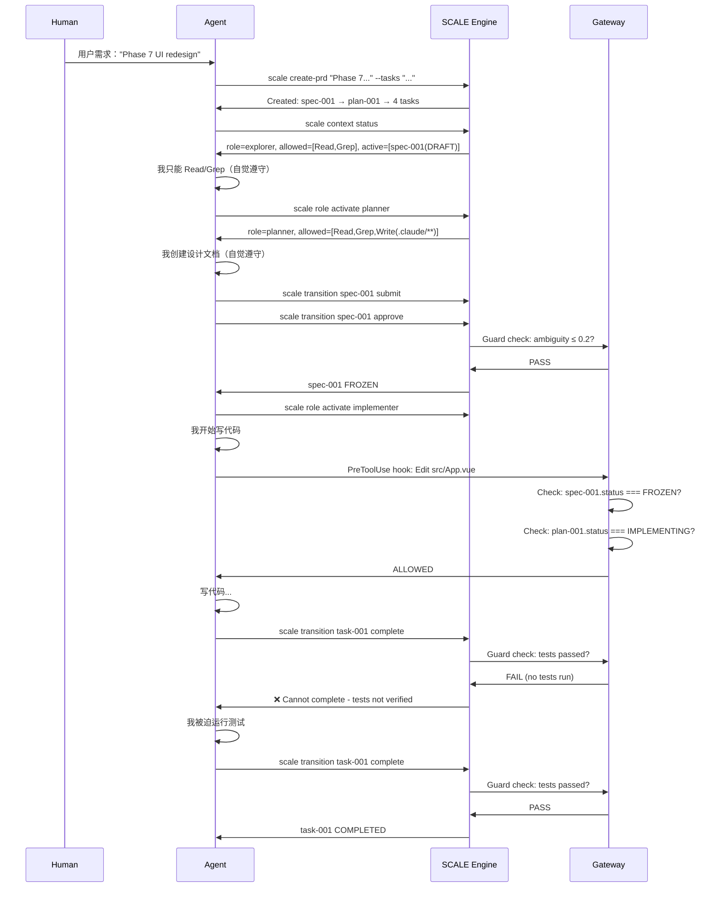

# SCALE Engine 工作流优化方案

## 当前问题诊断

### 1. 外部机制已实现，但未激活
**ClaudeCodeAdapter.generateSettings() 已配置完整 hooks：**
- SessionStart → scale session start
- PreToolUse → scale gate pre-tool (拦截 Bash/Edit/Write)
- PostToolUse → scale gate post-tool (记录输出)
- Stop → scale gate before-stop (防止 premature done)

**问题：**
- Demo 中没有运行 `scale init` → hooks 未配置
- 即使配置了，也没有测试是否真的能拦截 Agent

### 2. Agent 缺少 context awareness
**当前状态：**
- Agent 不知道当前在哪个 artifact 上下文中工作
- Agent 不知道当前 role（explorer/planner/implementer）
- Agent 不知道哪些工具被允许/禁止

**结果：**
- Agent 只能被动等待 hook 拦截
- Agent 无法主动查看约束（需要调用 suggest，但不知道调用哪个 artifact）

### 3. suggest 命令只显示 artifact-level 约束
**当前功能：**
```bash
scale suggest spec-001
# 显示：approve (❌ 被 Guard 拦截 - ambiguity > 0.2)
```

**缺少：**
- Session-level constraints（当前 role 允许哪些工具？）
- Global constraints（哪些命令被 Gateway 禁止？）
- Active artifacts（当前 session 正在处理哪些 artifacts？）

### 4. 缺少自动化 artifact 创建流程
**当前：**
- 用户需求 → Agent 手动创建 Spec → Plan → Tasks
- 每个都要手动输入命令

**应该：**
- 用户需求 → Agent 自动分析并创建层级
- 或者提供 `scale create-prd "需求描述"` 自动生成 Spec+Plan+Task 树

---

## 优化方案（三个层次）

### Layer 1: 修复激活机制（立即可做）

**目标：让 hooks 真正生效并测试**

```bash
# 1. 在项目中初始化
cd f:/project/work/maple-cart-mall
scale init --agent claude-code

# 2. 验证 hooks 配置
cat .claude/settings.json | grep "scale gate"

# 3. 测试拦截效果（我作为 Agent 尝试违规）
# - 创建 Spec（REVIEWING 状态）
# - 我尝试 Write 代码 → 应该被拦截（Spec 未 FROZEN）
# - 我运行 scale transition approve → 应该被 Guard 拦截（ambiguity > 0.2）
```

**验证标准：**
- 我看到 hook 输出的错误信息
- 我的操作真的被阻止（无法继续）
- EventBus 记录了拦截事件

---

### Layer 2: 增强 Agent Context Awareness（核心优化）

**新增命令：`scale context status`**

```bash
scale context status --session-id <session-id>
```

**输出：**
```json
{
  "sessionId": "ses-001",
  "role": "implementer",
  "allowedTools": ["Read", "Grep", "Edit", "Write", "Bash(npm:*)"],
  "deniedTools": ["Bash(rm:*)", "Bash(DROP:*)"],
  "activeArtifacts": [
    { "id": "spec-001", "type": "Spec", "status": "FROZEN" },
    { "id": "plan-001", "type": "Plan", "status": "IMPLEMENTING", "current": true },
    { "id": "task-001", "type": "Task", "status": "IN_PROGRESS" }
  ],
  "constraints": [
    "Spec must be FROZEN before writing code",
    "Plan must have approved design before implementation",
    "Tests must pass before marking Task COMPLETED"
  ]
}
```

**实现：**
```typescript
// src/context/ContextBuilder.ts 新增方法
async getStatus(sessionId: string): Promise<ContextStatus> {
  const session = await this.store.getSession(sessionId)
  const role = this.roleGate.getRole()
  const artifacts = await this.store.getActiveArtifacts(sessionId)
  
  return {
    sessionId,
    role: role.id,
    allowedTools: role.allowedTools,
    deniedTools: role.deniedTools,
    activeArtifacts: artifacts,
    constraints: this.extractConstraints(artifacts)
  }
}
```

**Agent 使用方式：**
- 每次会话开始时，我调用 `scale context status`
- 我知道当前能做什么，不能做什么
- 我主动遵守约束，而不是被动等待拦截

---

### Layer 3: 自动化 Artifact 创建流程（可选增强）

**新增命令：`scale create-prd`**

```bash
scale create-prd "Phase 7: 文件管理 UI 重设计" \
  --specs "三列布局 skeleton" \
  --plans "左侧导航树 + 中间文件列表 + 右侧预览面板" \
  --tasks "创建 skeleton, 实现导航树, 实现文件列表, 实现预览面板"
```

**自动生成：**
```
Spec: spec-001 (DRAFT)
  ├─ Plan: plan-001 (DRAFT)
  │   ├─ Task: task-001 (TODO) - 创建 skeleton
  │   ├─ Task: task-002 (TODO) - 实现导航树
  │   ├─ Task: task-003 (TODO) - 实现文件列表
  │   └─ Task: task-004 (TODO) - 实现预览面板
```

**实现逻辑：**
```typescript
// src/api/cli.ts 新增命令
const createPRD = defineCommand({
  meta: { name: 'create-prd', description: 'Create PRD hierarchy (Spec+Plan+Tasks)' },
  args: {
    title: { type: 'positional', required: true },
    specs: { type: 'string' },
    plans: { type: 'string' },
    tasks: { type: 'string' },
  },
  async run({ args }) {
    // 1. 创建 Spec
    const spec = await store.create({
      type: 'Spec',
      title: args.title,
      payload: { description: args.specs },
      initialStatus: 'DRAFT'
    })
    
    // 2. 创建 Plan（parent: spec.id）
    const plan = await store.create({
      type: 'Plan',
      title: `${args.title} - Implementation Plan`,
      payload: { design: args.plans },
      parents: [spec.id],
      initialStatus: 'DRAFT'
    })
    
    // 3. 批量创建 Tasks（parent: plan.id）
    const taskList = args.tasks.split(',').map(t => t.trim())
    for (const taskTitle of taskList) {
      await store.create({
        type: 'Task',
        title: taskTitle,
        parents: [plan.id],
        initialStatus: 'TODO'
      })
    }
    
    console.log(`Created: ${spec.id} → ${plan.id} → ${taskList.length} tasks`)
  }
})
```

---

## 优化后的工作流（理想状态）



**关键改进：**
1. Agent 有 context awareness → 主动遵守约束
2. Hooks 物理拦截 → 强制执行
3. 自动创建层级 → 降低操作成本
4. Guard 验证 → 防止虚假完成

---

## 实施优先级

### P0（立即做）
1. 测试 hooks 拦截效果（运行 scale init，尝试违规操作）
2. 添加 `scale context status` 命令（让 Agent 知道当前约束）

### P1（本周）
3. 增强 suggest 命令（显示 session-level constraints）
4. 添加 `scale create-prd` 命令（自动化创建流程）

### P2（后续）
5. Web Dashboard（可视化状态树）
6. IDE Integration（VSCode extension）
7. Evolution Engine 实战测试（真实提取 lessons）

---

## 成功标准

**测试场景：**
1. 我试图在 Spec REVIEWING 状态写代码 → **被拦截**
2. 我试图 approve ambiguity > 0.2 的 Spec → **被拦截**
3. 我试图 complete Task 未运行测试 → **被拦截**
4. 我调用 `scale context status` → **知道当前约束**
5. 我调用 `scale create-prd` → **自动生成层级**

**通过标准：**
- 我看到清晰的错误信息（知道为什么被拦截）
- 我的操作真的被阻止（无法继续）
- 我主动调用 context status 查看约束（自觉遵守）
- 自动化流程节省操作成本（不用手动逐个创建）

