# SCALE Engine Architecture

## System Overview

SCALE Engine is an AI Engineering Operating System that provides governance, workflow automation, and continuous evolution for AI-assisted development.

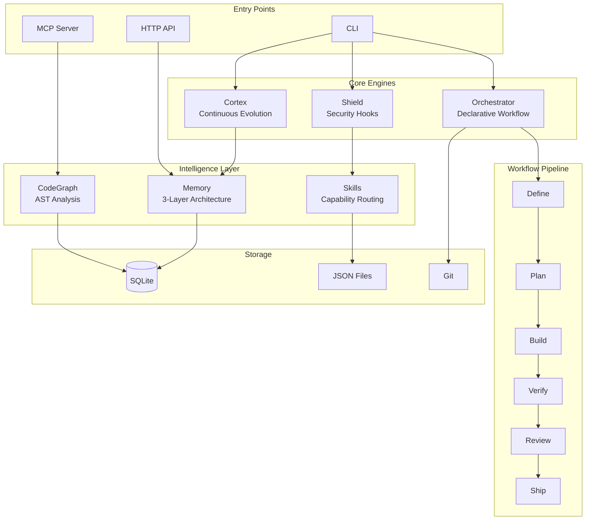

## Core Engines

### Shield

Hook-based security engine that intercepts dangerous commands.

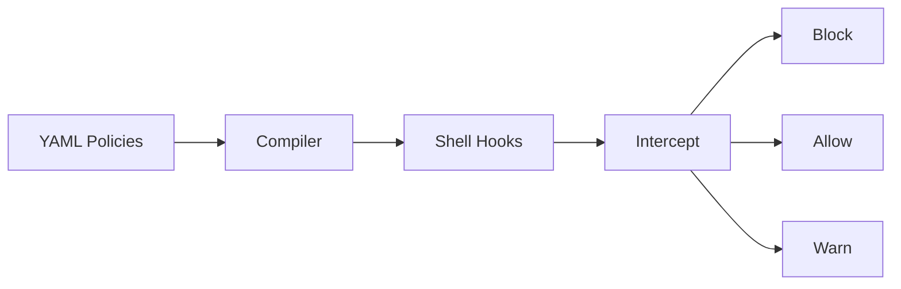

### Orchestrator

Declarative orchestration daemon with git worktree isolation.

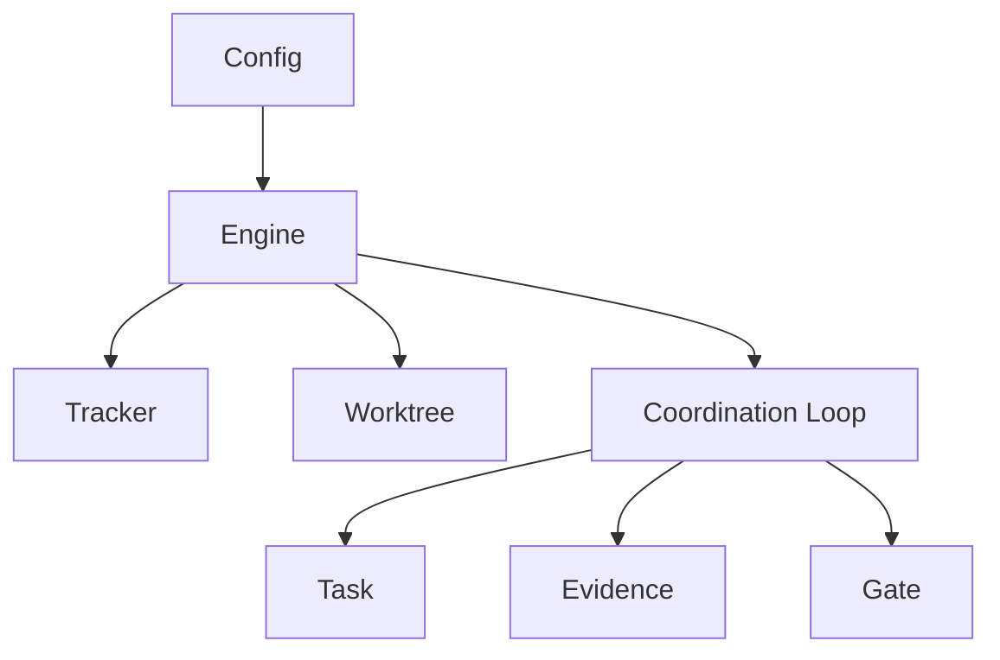

### Cortex

Evidence-driven continuous evolution with instinct extraction.

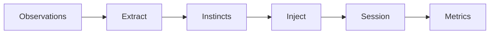

## Intelligence Layer

### CodeGraph

AST-based code intelligence using tree-sitter.

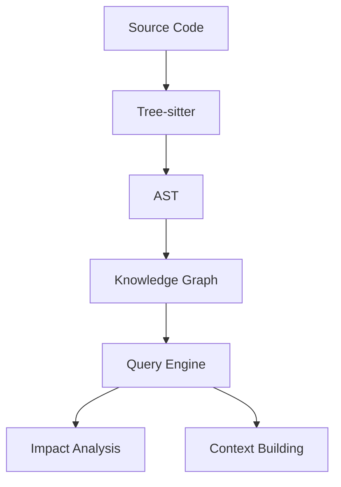

### Memory (3-Layer Architecture)

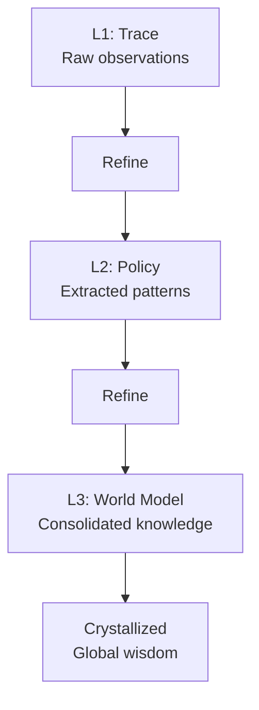

### Skills

Capability routing with supply chain safety.

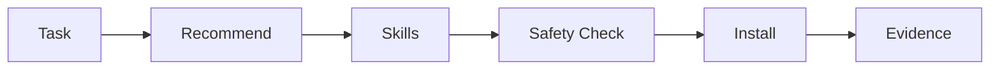

## Workflow Pipeline

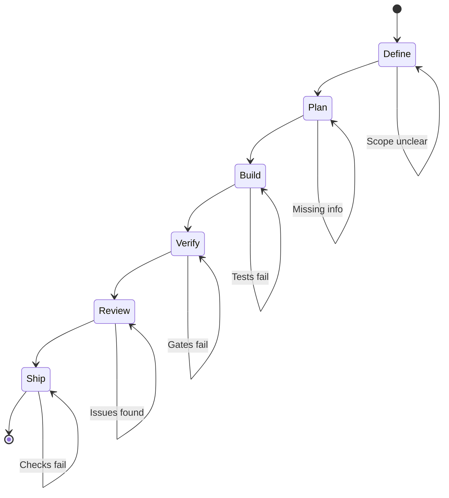

## Data Flow

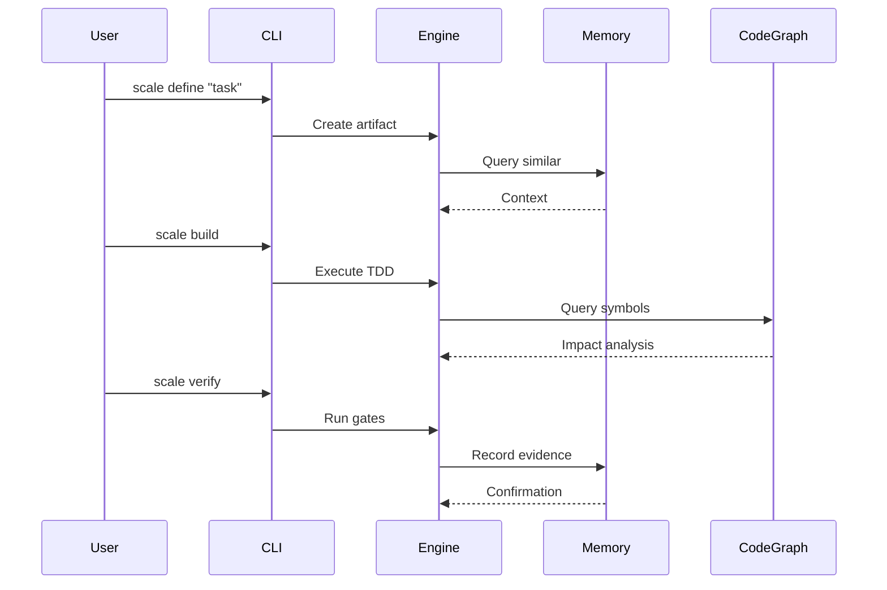

## Storage Architecture

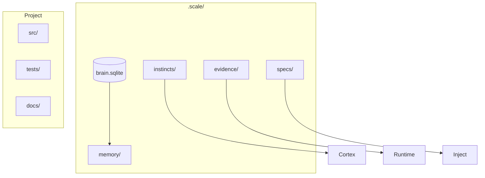

## Integration Points

### MCP Server

Model Context Protocol server over stdio for AI agent integration.

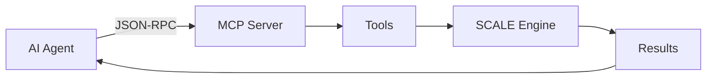

### HTTP API

Hono-based HTTP server for dashboard and external integrations.

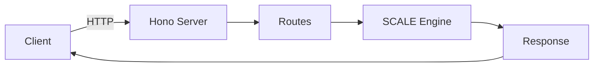

## Key Design Decisions

1. **SQLite over PostgreSQL**: Embedded, zero-config, sufficient for project-scoped data
2. **Functional composition**: Pure functions over classes for testability
3. **Evidence-first**: All decisions backed by observable evidence
4. **Progressive governance**: Gradual adoption of governance practices
5. **Supply chain safety**: Every external dependency verified before use
