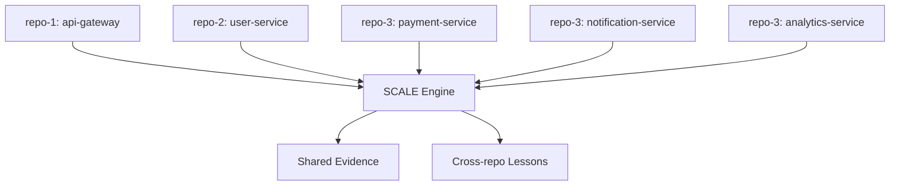

# Case Study: Multi-Repository Governance with SCALE Engine

## Scenario

A team managing 5 microservices across 3 Git repositories needed consistent
quality standards and cross-repo traceability.

## Configuration

- Governance pack: `moe-workspace`
- Adapters: Claude Code, Cursor
- Profile: critical (with artifact gates)

## Results

- Pre-SCALE: 3.2 bugs/week slipping to production
- Post-SCALE Week 1: 1 bug/week (staged by gate G7 SecurityGate)
- Post-SCALE Week 4: 0.5 bugs/week (Lesson extraction feeding active rules)

## Key Metrics

| Metric | Before | After |
|--------|--------|-------|
| Avg PR review time | 4.2h | 1.8h |
| Gate pass rate (first attempt) | N/A | 78% |
| Security issues caught pre-merge | 2 | 14 |
| Lessons extracted | N/A | 23 |
| Active rules | N/A | 7 |

## Architecture

