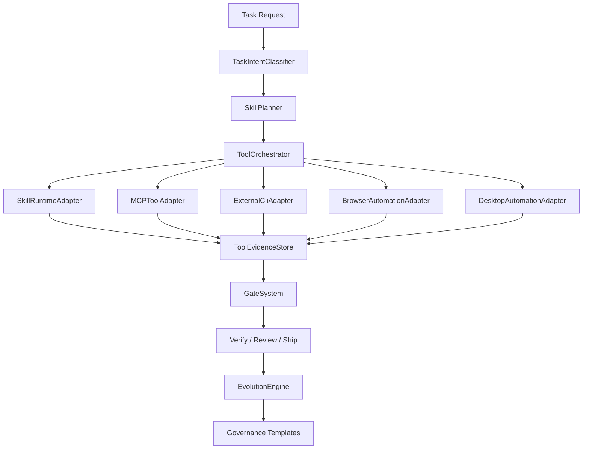
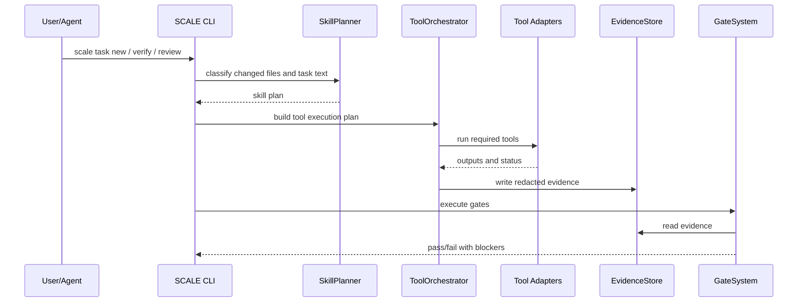

# SCALE Tool Orchestration Technical Architecture

Status: review draft
Owner: engineering governance
Date: 2026-05-15

## 1. Architecture Goal

Add a governed tool orchestration layer to SCALE without replacing the existing workflow engine. The layer should connect task intent, skill routing, MCP servers, external CLIs, browser automation, desktop automation, evidence storage, verification gates, engineering standards, resource governance, and self-evolution.

The implementation must preserve the current safe delivery path:

`define -> plan -> build -> verify -> review -> ship`

## 2. Current Implementation Baseline

Current strong points:

- `SkillPolicy` defines domain routing for UI, web research, browser automation, E2E, desktop automation, external CLI, API, DB, security, docs, resource governance, engineering standards, review, release, skill discovery, and full-stack prototype work.
- `SkillPlanner` can generate required skills, recommended skills, required artifacts, and required verification evidence.
- `SkillExecutor` already has execution types for CLI command, builtin function, agent delegate, and MCP tool.
- `EngineeringStandards` scans logging, security, database, architecture, framework, testing, and UI/UX findings.
- `ResourceGovernance` classifies assets by lifecycle and Git policy.
- `WorkspaceTopology` and ship boundary checks support MOE and child repository blockers.
- `Review -> ship` blocks unreviewed files and avoids broad workspace staging.

Current gaps:

- `WorkflowEngine.executeSkill()` returns delegated metadata instead of invoking `SkillExecutor`.
- `WorkflowEngine.executeMCPCapability()` routes by name but does not execute real MCP calls.
- Skill evidence is required by policy but not consistently collected as a normalized tool-run ledger.
- UI/browser evidence is not yet a first-class gate with screenshots, console, network, and responsive checks.
- Engineering standards scanning is useful but should evolve toward language and framework-specific adapters.

## 3. Proposed Module Map



## 4. New Core Components

### 4.1 ToolOrchestrator

Responsibility:

- Accept a `SkillPlan`.
- Resolve required and recommended tools.
- Check tool availability.
- Build execution steps.
- Enforce safety policy.
- Execute tools through adapters.
- Persist normalized evidence.
- Return gate-ready summaries.

Primary API:

```ts
interface ToolOrchestrator {
  plan(input: ToolPlanInput): Promise<ToolExecutionPlan>
  run(plan: ToolExecutionPlan, options: ToolRunOptions): Promise<ToolRunReport>
  doctor(projectDir: string): Promise<ToolDoctorReport>
}
```

### 4.2 ToolCapabilityRegistry

Responsibility:

- Detect installed skills by `SKILL.md`.
- Detect MCP servers and exposed tool schemas.
- Detect external CLIs and versions.
- Detect browser automation availability.
- Detect desktop automation availability.

Expected checks:

- `agent-browser --version`
- `agent-browser doctor --json`
- `npx playwright --version`
- Chrome DevTools MCP availability
- `codex --version`
- `gemini --version`
- `opencode --version`
- local skill directories with `SKILL.md`

### 4.3 ToolEvidenceStore

Responsibility:

- Store tool-run evidence in `.scale/evidence/tool-runs/`.
- Redact secrets before persistence.
- Link evidence to task artifacts.
- Provide concise summaries for CLI and detailed JSON for audit.

Evidence schema:

```ts
interface ToolRunEvidence {
  id: string
  taskId: string
  domain: string
  tool: string
  adapter: 'skill' | 'mcp' | 'cli' | 'browser' | 'desktop'
  version?: string
  command?: string
  mcpToolName?: string
  startedAt: string
  completedAt: string
  exitCode?: number
  status: 'passed' | 'failed' | 'skipped'
  sanitizedInput: Record<string, unknown>
  outputSummary: string
  outputPaths: string[]
  redactionApplied: boolean
  safetyPolicy: string[]
}
```

### 4.4 SkillRuntimeAdapter

Responsibility:

- Load skill metadata from `SKILL.md`.
- Resolve referenced scripts/templates only when needed.
- Support local `.agents/skills`, `.codex/skills`, `.claude/skills`, and project skills.
- Execute script-backed or CLI-backed skills through `SkillExecutor`.
- For instruction-only skills, produce an evidence record showing which skill was loaded and how it shaped the task artifacts.

Important boundary:

- Instruction-only skills cannot be counted as runtime verification unless they produce concrete artifacts or are paired with a command.

### 4.5 MCPToolAdapter

Responsibility:

- Discover MCP tools by schema.
- Execute tool calls through configured MCP clients.
- Capture tool input/output summaries.
- Enforce allowlists and side-effect policies.

Safety rules:

- No credential values in evidence.
- No write-capable MCP server is trusted by default.
- Tool descriptions are not trusted as policy. SCALE policy decides whether a tool is allowed.

### 4.6 ExternalCliAdapter

Responsibility:

- Safely invoke external CLIs such as Codex, Gemini CLI, OpenCode, agent-browser, Playwright, or project-specific tools.
- Require version checks.
- Prefer dry-run or read-only mode for review.
- Capture stdout/stderr summaries and exit codes.

Side-effect policy:

- `review` mode: read-only commands only.
- `verify` mode: test/build/browser commands allowed.
- `ship` mode: no external CLI may mutate Git state unless explicitly listed.

### 4.7 BrowserAutomationAdapter

Responsibility:

- Run browser flows through agent-browser, Playwright, Chrome DevTools MCP, or webapp-testing.
- Capture screenshots, console logs, network summaries, and viewport metadata.
- Support desktop and mobile viewport checks.
- Support domain allowlists and action policies.

Required output for UI tasks:

- screenshot paths
- console error summary
- network failure summary
- tested viewport list
- accessibility or semantic locator notes when available

### 4.8 DesktopAutomationAdapter

Responsibility:

- Use CUA or platform-specific desktop automation only for explicitly enabled projects.
- Capture before/after screenshots.
- Record side-effect boundaries.
- Require destructive action confirmation.

Default:

- Disabled unless `.scale/tools.json` enables desktop automation.

## 5. Configuration Files

### 5.1 `.scale/tools.json`

```json
{
  "version": 1,
  "mode": "evidence-required",
  "tools": {
    "agent-browser": {
      "enabled": true,
      "requiredFor": ["browserAutomation", "ui"],
      "allowedDomains": ["localhost", "127.0.0.1"],
      "destructiveActions": "confirm"
    },
    "web-access": {
      "enabled": true,
      "requiredFor": ["webResearch"]
    },
    "chrome-devtools-mcp": {
      "enabled": true,
      "requiredFor": ["browserAutomation"]
    },
    "desktop-cua": {
      "enabled": false,
      "requiredFor": [],
      "destructiveActions": "block"
    },
    "external-agent-review": {
      "enabled": false,
      "tools": ["codex", "gemini", "opencode"],
      "mode": "read-only"
    }
  }
}
```

### 5.2 `.scale/evidence/tool-runs/<task-id>/<run-id>.json`

Stores normalized evidence records. The directory should be ignored by default unless a project chooses to retain evidence.

### 5.3 `.scale/engineering-standards.json`

Extends the current standards policy with stack profiles:

```json
{
  "version": 1,
  "mode": "warn",
  "profiles": ["typescript-react", "java-spring", "go-zero"],
  "logging": {
    "approvedLoggers": ["logger", "log", "pino"],
    "sensitiveFields": ["token", "password", "secret", "authorization", "cookie"]
  }
}
```

## 6. Gate Integration

| Gate | New Tool-Orchestration Responsibility |
| --- | --- |
| G1 Explore | Classify task intent and generate skill/tool plan |
| G2 Plan | Check Mini-PRD, architecture plan, rollback, test strategy |
| G3 TDD | Ensure required test evidence or explicit not-applicable reason |
| G4 Lint | Run service/profile-aware lint |
| G5 Test | Run service/profile-aware tests |
| G6 Type/Build | Run build/typecheck commands |
| G7 Security | Run standards/security profile and threat-model evidence |
| G8 UI/Browser | Run browser evidence collection for UI/browser domains |
| G9 Resource | Run resource doctor and settle report |
| G10 Tool Evidence | Ensure required tool runs are present and non-placeholder |

## 7. Execution Sequence



## 8. Security And Safety Model

1. Tool execution defaults to least privilege.
2. Browser automation uses domain allowlists.
3. Desktop automation is disabled by default.
4. Secrets are redacted from logs and evidence.
5. Write-capable MCP tools require explicit project policy.
6. Destructive actions require confirmation and rollback notes.
7. External agent CLIs run in read-only mode unless explicitly approved.
8. Evidence captures command status and summaries, not raw credentials.

## 9. Testing Strategy

### Unit Tests

- Tool policy resolution
- Tool capability detection
- Evidence redaction
- Skill plan to tool plan conversion
- Gate behavior for missing evidence
- Resource classification
- Standards profile findings

### Integration Tests

- `scale verify` blocks missing required tool evidence for M/L tasks.
- `scale verify` passes when required evidence exists.
- `scale ship` blocks dirty MOE child repositories.
- `scale ship` stages only reviewed files.
- Browser evidence gate accepts screenshot, console, and network artifacts.
- Resource settle writes impact report and flags forbidden tracked assets.

### Smoke Tests

- `npm run build`
- `npx vitest run`
- `git diff --check`
- `node dist/api/cli.js doctor --json`
- `node dist/api/cli.js skill doctor --json`

## 10. Implementation Plan

### Phase 1: Tool Evidence Contract

Files:

- `src/tools/ToolEvidenceStore.ts`
- `src/tools/ToolPolicy.ts`
- `src/tools/ToolCapabilityRegistry.ts`
- tests under `tests/tools/`

Acceptance criteria:

- Evidence schema is stable.
- Redaction test covers token, password, cookie, authorization, and secret.
- Tool doctor reports installed/missing tools in JSON.

### Phase 2: Tool Orchestrator

Files:

- `src/tools/ToolOrchestrator.ts`
- `src/tools/adapters/*.ts`
- `src/skills/routing/SkillPlanner.ts` integration

Acceptance criteria:

- A skill plan can become a tool execution plan.
- Missing required tools become blockers in block mode.
- Missing optional tools become warnings.

### Phase 3: WorkflowEngine Integration

Files:

- `src/workflow/WorkflowEngine.ts`
- `src/cli/phaseCommands.ts`
- `src/workflow/gates/GateSystem.ts`

Acceptance criteria:

- `executeSkill()` delegates to `SkillExecutor`.
- `executeMCPCapability()` delegates to the appropriate adapter.
- Verify/review reads tool evidence.

### Phase 4: UI/Browser Gate

Files:

- `src/workflow/qa/E2ETestRunner.ts`
- `src/capabilities/BrowserQACapability.ts`
- `src/tools/adapters/BrowserAutomationAdapter.ts`

Acceptance criteria:

- UI task verification requires screenshots and console/network summaries.
- Browser evidence can be generated in dry-run or real mode.

### Phase 5: Governance Pack Output

Files:

- `src/workflow/GovernanceTemplatePacks.ts`
- `src/workflow/GovernanceTemplates.ts`

Acceptance criteria:

- `scale init` can generate `.scale/tools.json`.
- Project docs describe tool orchestration policy.
- Existing files are not silently overwritten.

### Phase 6: Self-Evolution Feedback Loop

Files:

- `src/evolution/EvolutionEngine.ts`
- `src/workflow/evolution/*`

Acceptance criteria:

- Gate failures can become lesson candidates.
- Candidate rules require review before promotion.
- Promoted rules include tests or explicit manual verification.

## 11. Backward Compatibility

1. Existing projects without `.scale/tools.json` use advisory mode.
2. Existing `scale verify/review/ship` flows continue to work.
3. S-level work does not require tool evidence by default.
4. MOE boundary checks remain active for configured multi-repository topologies.

## 12. Review Checklist

- Does the architecture avoid turning SCALE into a fragile mega-agent?
- Are browser and desktop automation safety boundaries strict enough?
- Are evidence files useful without polluting Git?
- Are language/framework profiles flexible enough for Java, Go, React, Node, and Python?
- Is the default workflow still convenient for users?
- Are all blocking gates backed by tests?
