# SCALE Agent Engineering OS Upgrade Plan

Status: review draft
Owner: engineering governance
Date: 2026-05-19
Scope: context budget, code intelligence, long-term memory, skill orchestration, HTML artifacts, workflow eval, and resource governance

## 1. Executive Summary

SCALE should evolve from an executable engineering workflow engine into an Agent Engineering OS for real project delivery.

The goal is not to become a large prompt pack or a bundle of unrelated skills. The goal is to make agent-assisted engineering measurably better in large repositories:

- fewer unnecessary file reads
- fewer repeated searches
- lower context token cost
- stronger codebase understanding
- better long-term project memory
- safer skill, MCP, CLI, browser, and desktop tool usage
- more readable human review artifacts
- stricter engineering governance and release evidence

This plan absorbs the useful ideas from several external directions without copying them wholesale:

| Reference | What SCALE should learn | What SCALE should not copy blindly |
| --- | --- | --- |
| GBrain | Long-term memory, entity and relation graph, background memory maintenance, local-first storage | Full memory OS complexity before project-governance use cases are proven |
| CodeGraph | Pre-indexed code graph, callers/callees/impact queries, fewer tool calls and fewer tokens | Building a full multi-language parser before adapter value is validated |
| html-effectiveness | HTML artifacts for plan comparison, code review, reports, dashboards, and prototypes | Replacing all Markdown documentation with HTML |
| html-anything | HTML as final presentation artifact, sandboxed preview, multi-format input conversion | Making HTML the source of truth for maintainable docs |
| anime.js | Lightweight interaction for HTML reports | Decorative animation that does not improve comprehension |
| everything-claude-code | Context budget thinking, continuous learning, eval harness, broad skill/agent catalog | Asset bloat and always-loaded prompt/rule sprawl |

The guiding product principle:

```text
SCALE owns governance and evidence.
External tools provide optional capability.
Every capability must be measurable, auditable, and safe to disable.
```

## 2. Current SCALE Baseline

Current strong points:

- `scale init` generates governance packs, task artifacts, service matrix, skill policy, resource policy, and verification templates.
- Runtime Evidence records real commands, tool calls, session events, and final delivery checks.
- Memory Fabric can build scoped context packs from evidence, session events, knowledge recall, and graph status.
- Resource Governance classifies canonical docs, generated reports, temporary files, media, scripts, and Git retention policy.
- Tool Orchestration docs and skill policy already recognize UI/UX, browser automation, E2E, desktop automation, external CLI, security, docs, resource, review, and release domains.
- MOE workspace support handles root repositories, nested repositories, child repository cleanup, and unsafe finish checks.
- HTML artifact support exists as a governed output direction.

Current gaps:

- Context cost is not yet a first-class measurable CLI report.
- Code graph support is still shallow; SCALE detects graph artifacts but does not provide code intelligence queries.
- Memory candidates are evidence-backed, but there is no structured long-term project brain with facts, decisions, incidents, relations, confidence, contradiction detection, and maintenance jobs.
- Skill routing exists, but it needs stronger active recommendation, supply-chain safety, capability manifests, and evidence enforcement.
- Workflow quality is not yet benchmarked with pass@k, tool-call count, token estimate, and human correction count.
- HTML artifacts need standardized report templates and clear source-of-truth rules.
- Agent role presets should connect to executable workflow phases instead of only living as guidance text.

## 3. Product Goals

1. Reduce exploration token cost by preferring code graph queries and scoped context packs over broad grep/read loops.
2. Build long-term project memory that improves future tasks without polluting current context.
3. Make skills, MCP, CLI, browser automation, and desktop automation actively recommended but safely governed.
4. Convert engineering workflow quality into measurable eval results.
5. Make complex plans, reviews, E2E reports, and release evidence easier for humans to inspect through HTML artifacts.
6. Keep Markdown and JSON as maintainable source artifacts; use HTML for human-facing final presentation.
7. Preserve fast paths for small tasks.
8. Make every new capability optional, inspectable, and safe to disable.

## 4. Non-Goals

1. Do not replace Codex, Claude Code, Gemini CLI, OpenCode, Cursor, or IDE indexing.
2. Do not vendor a large third-party memory or code graph stack into SCALE by default.
3. Do not auto-install external skills, MCP servers, or CLIs without safety checks.
4. Do not convert all documentation to HTML.
5. Do not promote one-session observations into durable standards automatically.
6. Do not require large workflow overhead for S-level edits.
7. Do not make animation, dashboards, or visuals more important than verification evidence.

## 4.1 Design Corrections From Review

An external review correctly identified the strongest direction and the largest risk: SCALE is moving toward Agent Engineering Infrastructure, but it can fail if governance becomes heavier than the work it protects.

The review feedback is adopted as design constraints, not as marketing claims.

| Review Item | Decision | Why |
| --- | --- | --- |
| Progressive Governance | Adopt | Static S/M/L/CRITICAL levels are not enough; risk should escalate from task facts and changed files. |
| Governance ROI | Adopt | Every governance module must prove it reduces cost, rework, risk, or ambiguity. |
| Lazy Loading Architecture | Adopt | SCALE must not become its own context pollution source. |
| Capability Confidence | Adopt | Agents should not pretend a tool is reliable when task evidence is weak. |
| Failure Replay System | Adopt | Failed trajectories are more useful for workflow improvement than success-only metrics. |
| "Agent OS" positioning | Use internally, soften externally | Useful architecture frame, but external messaging should stay evidence-grounded. |
| Broad commercial upside claims | Do not use as implementation evidence | Product claims must be backed by evals, demos, and adoption metrics. |

New hard constraints:

1. Any new module must be optional or progressively activated.
2. Any new module must emit an ROI signal.
3. Any new module must define its artifact lifecycle.
4. Any new module must have fallback behavior.
5. S-level tasks must stay lightweight by default.
6. No claim of workflow improvement is accepted without eval or runtime evidence.

## 5. Target Architecture

```mermaid
flowchart TD
  A["Task Request"] --> B["SCALE Orchestrator"]
  B --> P["Progressive Governance"]
  B --> C["Context Budget Engine"]
  B --> D["Code Intelligence Layer"]
  B --> E["Memory Brain"]
  B --> F["Skill Radar"]
  B --> G["Governance Gates"]
  B --> H["HTML Artifact Studio"]
  B --> I["Workflow Eval Harness"]
  B --> R["Governance ROI"]

  C --> C1["Context Pack"]
  C --> C2["Budget Report"]
  C --> C3["Lazy Activation"]

  D --> D1["CodeGraph Adapter"]
  D --> D2["Graphify Adapter"]
  D --> D3["Fallback rg/read"]

  E --> E1["Facts"]
  E --> E2["Decisions"]
  E --> E3["Incidents"]
  E --> E4["Relations"]
  E --> E5["Contradictions"]

  F --> F1["Skills"]
  F --> F2["MCP"]
  F --> F3["CLI"]
  F --> F4["Browser/Desktop Automation"]
  F --> F5["Supply Chain Doctor"]
  F --> F6["Capability Confidence"]

  G --> G1["Verify"]
  G --> G2["Review"]
  G --> G3["Security"]
  G --> G4["Resource Governance"]

  H --> H1["Plan Comparison"]
  H --> H2["Code Review"]
  H --> H3["E2E Report"]
  H --> H4["Release Report"]
  H --> H5["Dashboard"]

  I --> I1["Capability Eval"]
  I --> I2["Regression Eval"]
  I --> I3["Pass@k Metrics"]
  I --> I4["Failure Replay"]

  P --> G
  R --> I
```



## 6. Module 1: Context Budget Engine

### 6.1 Purpose

Make token usage visible and governable. Agents should not load all rules, memories, skills, docs, reports, and graph outputs by default.

### 6.2 New Commands

```bash
scale context budget
scale context budget --json
scale context pack --task "fix cross-driver copy" --level M --budget 4000
scale context doctor --max-always 2500 --max-task 8000
```

### 6.3 Inputs

- `AGENTS.md`
- `CLAUDE.md`
- `.scale/*.json`
- governance templates
- skill policy
- MCP configuration
- runtime evidence summaries
- memory candidates
- code graph summaries
- current task artifacts

### 6.4 Classification

| Class | Meaning | Loading Policy |
| --- | --- | --- |
| Always | Tiny rules every agent must see | Keep under strict token budget |
| On-demand | Load only when task trigger matches | Use skill radar or memory query |
| Evidence | Keep summary in context, reference full path | Prefer artifact path over full content |
| Archive | Historical or stale content | Never load unless explicitly requested |
| Generated | Reports, screenshots, E2E output, graphs | Store manifest and summary only |

### 6.5 Output Artifacts

```text
.scale/context-budget.json
.scale/context-pack/<task-id>.json
docs/worklog/tasks/<task-id>/context-budget.html
```

### 6.6 Acceptance Criteria

- `scale context budget --json` reports estimated token cost by file and category.
- `scale context doctor` fails when Always-loaded content exceeds configured limits.
- Context packs show which sections were included, truncated, or omitted.
- Reports recommend concrete actions such as demote-to-on-demand, archive, summarize, or split.

### 6.7 Lazy Loading Architecture

Context Budget must enforce lazy loading, not only report after the fact.

Each governance module should expose a small capability manifest:

```ts
interface CapabilityManifest {
  id: string
  summary: string
  triggers: string[]
  alwaysTokens: number
  onDemandArtifacts: string[]
  requiredEvidence: string[]
  fallback: string
}
```

Default behavior:

1. Load only core workflow rules and the current task objective.
2. Activate module summaries when triggers match.
3. Load detailed docs, templates, skill instructions, graph snippets, and memory records only on demand.
4. Keep generated HTML, E2E reports, screenshots, and release reports out of prompt context by default.
5. Prefer artifact paths, short summaries, and IDs over full document bodies.

New acceptance criteria:

- `scale context budget` reports Always-loaded token cost separately from on-demand token cost.
- Any module with `alwaysTokens` above the threshold must be split or demoted.
- Context packs include a `lazyLoaded` section showing what was activated and why.
- Context packs include an `omitted` section so agents know what was intentionally left out.

## 7. Module 2: Code Intelligence Layer

### 7.1 Purpose

Use code graph queries before broad text exploration. This should reduce token consumption and improve impact analysis.

### 7.2 Strategy

Start as an adapter layer:

1. Detect external CodeGraph capability if installed.
2. Detect Graphify outputs if present.
3. Provide a stable SCALE query interface.
4. Fall back to `rg/read` when no graph source is available.

This avoids committing SCALE to one parser implementation before value is validated.

### 7.3 New Configuration

```json
{
  "version": "1.0",
  "providers": [
    {
      "id": "codegraph",
      "type": "external-cli",
      "enabled": true,
      "command": "codegraph",
      "capabilities": ["symbols", "callers", "callees", "impact", "context"]
    },
    {
      "id": "graphify",
      "type": "artifact",
      "enabled": true,
      "manifest": "graphify-out/GRAPH_REPORT.md",
      "capabilities": ["summary", "module-map"]
    }
  ],
  "fallback": {
    "enabled": true,
    "tools": ["rg", "read"]
  }
}
```

Suggested path:

```text
.scale/code-intelligence.json
```

### 7.4 New Commands

```bash
scale codegraph status
scale codegraph init
scale codegraph query "who calls UserService.create"
scale codegraph impact --symbol UserService.create
scale codegraph context --symbol UserService.create --budget 2000
scale explore --use-codegraph
```

### 7.5 Workflow Changes

For M/L/CRITICAL tasks:

1. Query code graph for symbols, callers, callees, and impact.
2. Generate a scoped file list.
3. Read only the minimum required files.
4. Record graph hits and fallback reasons in `explore.md`.

### 7.6 Metrics

| Metric | Definition |
| --- | --- |
| graph_hit_rate | Percent of exploration questions answered by graph provider |
| file_reads_saved | Baseline file reads minus graph-assisted file reads |
| tool_calls_saved | Baseline tool calls minus graph-assisted tool calls |
| impact_precision | Files actually changed divided by files predicted as impacted |
| fallback_rate | Percent of queries that fall back to text search |

### 7.7 Acceptance Criteria

- SCALE can run without CodeGraph installed.
- When CodeGraph exists, SCALE surfaces its availability and capability list.
- Impact reports include graph provider, query, files, symbols, and confidence.
- Fallbacks are explicit, not silent.

## 8. Module 3: Memory Brain

### 8.1 Purpose

Turn runtime evidence and reviewed learnings into long-term, project-scoped memory.

Memory Brain is not the same as Memory Fabric:

- Memory Fabric builds the short context pack for the current task.
- Memory Brain stores long-term project knowledge with evidence, confidence, and relations.

### 8.2 Storage

Use local SQLite first:

```text
.scale/memory/brain.sqlite
.scale/memory/brain-manifest.json
```

This fits SCALE's local-first governance model and avoids requiring a server for the first version.

### 8.3 Core Records

| Record | Meaning | Example |
| --- | --- | --- |
| fact | Stable project fact | Gateway service lives in `amdox-go-gateway` |
| decision | Reviewed architectural or process decision | Use fixed OAuth callback path |
| incident | Failure and fix evidence | Route 404 caused by frontend/backend path mismatch |
| relation | Entity or module relationship | UI calls gateway, gateway proxies netdisk |
| contradiction | Conflict between memory, docs, code, or evidence | README says provider enabled, Nacos says disabled |

### 8.4 Schema Draft

```ts
interface MemoryNode {
  id: string
  type: 'fact' | 'decision' | 'incident' | 'relation' | 'contradiction'
  title: string
  summary: string
  entities: string[]
  source: 'runtime-evidence' | 'task-artifact' | 'docs' | 'git' | 'manual'
  evidencePaths: string[]
  confidence: number
  scope: 'project' | 'workspace' | 'global-candidate'
  status: 'candidate' | 'active' | 'stale' | 'rejected'
  createdAt: string
  updatedAt: string
  lastVerifiedAt?: string
}
```

### 8.5 New Commands

```bash
scale memory ingest --from evidence --task-id <task-id>
scale memory ingest --from failure --failure-id <failure-replay-id>
scale memory query "OAuth callback state design"
scale memory contradictions
scale memory dream
scale memory promote <candidate-id>
scale memory export --format jsonl
scale memory import memory.jsonl
```

### 8.6 Background Maintenance

`scale memory dream` should:

- deduplicate similar facts
- mark stale facts
- detect contradictions
- connect entities and modules
- suggest docs to update
- suggest candidates to promote
- lower confidence when evidence becomes stale

It must not auto-promote blocking standards.

### 8.7 Acceptance Criteria

- Every active memory has at least one evidence path.
- Contradictions are reported instead of silently resolved.
- Project memory does not become global unless promoted.
- Memory query returns concise context and references, not long dumps.

## 9. Module 4: Skill Radar 2.0

### 9.1 Purpose

Agents must actively and safely use skills, MCP, CLI, browser automation, and desktop automation when they improve quality.

Skill Radar should answer:

- Which capabilities are relevant to this task?
- Are they installed?
- Are they safe?
- What evidence must they produce?
- What is the fallback if they are unavailable?

### 9.2 New Commands

```bash
scale skill radar --task "design upload page and run E2E"
scale skill doctor --supply-chain
scale skill plan --task-id <task-id>
scale skill evidence --task-id <task-id>
```

### 9.3 Safety Levels

| Level | Meaning | Policy |
| --- | --- | --- |
| trusted | Built-in or reviewed local capability | May recommend automatically |
| review-required | External skill, MCP, or CLI not yet reviewed | Require safety review before use |
| restricted | Browser, desktop, filesystem, network, or credential-adjacent action | Require evidence and policy boundary |
| blocked | Dangerous install script, secret access, destructive default behavior | Do not execute |

### 9.4 Supply Chain Checks

Check:

- source URL
- package scripts
- postinstall behavior
- binary downloads
- remote shell patterns
- permission scope
- MCP tool surface
- license and maintenance signal
- local allowlist or denylist

### 9.5 Evidence Requirements

| Domain | Evidence |
| --- | --- |
| UI/UX | design rationale, screenshot, visual review |
| Browser/E2E | screenshot, console/network summary, command output |
| Desktop automation | operator boundary, screenshot, affected app |
| External CLI | command, exit code, output summary |
| Security | finding list, severity, fix or accepted risk |
| Docs | changed docs, source-of-truth mapping |

### 9.6 Acceptance Criteria

- Skill recommendations include reason, safety level, evidence requirement, and fallback.
- Missing tools are not treated as success.
- High-risk tools cannot run without explicit policy.
- Tool usage is recorded in task artifacts and runtime evidence.

### 9.7 Capability Confidence

Skill Radar must avoid "tool theater": recommending a capability does not mean the agent can reliably use it in the current environment.

Every recommendation should include confidence:

```json
{
  "capability": "browser-automation",
  "confidence": 0.72,
  "reason": "frontend files changed, dev server command exists, and browser skill is installed",
  "risk": "requires interactive page state and may need credentials",
  "requiredEvidence": ["screenshot", "console-summary", "scenario-result"],
  "fallback": "manual smoke checklist plus static route verification"
}
```

Confidence inputs:

| Signal | Effect |
| --- | --- |
| Required skill installed and reviewed | Raises confidence |
| Matching project stack and scripts detected | Raises confidence |
| Required credentials or local server missing | Lowers confidence |
| Prior successful evidence in this project | Raises confidence |
| Prior failures or flaky automation | Lowers confidence |
| High side-effect or security risk | Requires stricter evidence |

Policy:

- Confidence below `0.4`: do not auto-run; suggest fallback.
- Confidence `0.4` to `0.7`: recommend, but require explicit evidence and fallback.
- Confidence above `0.7`: may run if safety level allows.
- Confidence never replaces verification evidence.

## 10. Module 5: HTML Artifact Studio

### 10.1 Purpose

Use HTML for human-facing final artifacts where layout, comparison, filtering, visualization, or interaction improves review quality.

Markdown remains the source of truth for maintainable text documents.

### 10.2 New Commands

```bash
scale artifact html --type plan-comparison --task-id <task-id>
scale artifact html --type code-review --task-id <task-id>
scale artifact html --type e2e-report --task-id <task-id>
scale artifact html --type release-report --task-id <task-id>
scale artifact html --type context-budget --task-id <task-id>
```

### 10.3 Template Types

| Type | Use Case |
| --- | --- |
| plan-comparison | Compare approaches, tradeoffs, risks, and decision drivers |
| code-review | Severity-ranked findings, impacted files, diff notes, verification |
| e2e-report | Screenshots, scenarios, failures, console/network summaries |
| release-report | Version, tag, build, tests, package, remotes, residual risks |
| context-budget | Token cost, always/on-demand/archive classification |
| governance-dashboard | Memory, resources, eval, verification, skill usage |

### 10.4 HTML Policy

- Default output is single-file HTML.
- Use inline CSS and minimal JS.
- No external script by default.
- Optional anime.js-style micro-interactions only when they improve comprehension.
- HTML artifacts must have an `artifact-manifest.json`.
- Resource Governance decides whether the HTML is retained, archived, ignored, or promoted.

### 10.5 Acceptance Criteria

- HTML reports open locally without a build step.
- Source data is JSON or Markdown, not only HTML.
- Reports clearly show verification status and unverified items.
- Generated HTML is classified by resource governance.

## 11. Module 6: Workflow Eval Harness

### 11.1 Purpose

Prove whether SCALE improves agent delivery. Without evals, "self-evolution" is opinion.

### 11.2 New Commands

```bash
scale eval init
scale eval run --suite workflow-baseline
scale eval compare --baseline v0.19.0 --candidate local
scale eval report --html
```

### 11.3 Eval Types

| Type | Example |
| --- | --- |
| bugfix | Fix a route mismatch or cross-driver copy failure |
| feature | Add API with Mini-PRD and verification |
| refactor | Improve structure without behavior change |
| security | Detect unsafe logging, XSS, injection, or secret leakage |
| frontend | UI change with visual and browser evidence |
| release | Build, test, tag, package, publish, remote verification |
| resource | Settle generated docs, reports, screenshots, scripts |

### 11.4 Metrics

| Metric | Definition |
| --- | --- |
| pass_at_1 | Task succeeds on first full attempt |
| pass_at_3 | Task succeeds within three attempts |
| pass_power_3 | Three consecutive attempts pass |
| fix_iterations | Number of correction loops after first implementation |
| file_reads | Number of files read during exploration |
| tool_calls | Number of tool calls used |
| estimated_tokens | Estimated context and tool-output tokens |
| human_corrections | Number of human corrections needed |
| hallucination_count | Claims not backed by evidence |
| skill_effectiveness | Selected skills that produced useful evidence |
| residual_risk_clarity | Whether final report states real remaining risk |

### 11.5 Acceptance Criteria

- Eval cases are stored under `.scale/evals/` or `tests/evals/`.
- Reports compare baseline and candidate behavior.
- Failures produce actionable workflow improvements.
- Metrics are lightweight enough to run in development.

### 11.6 Failure Replay System

Eval Harness must preserve failure trajectories, not only final pass/fail.

Failure replay records:

| Field | Meaning |
| --- | --- |
| task | Original task and success criteria |
| phase | Explore, plan, build, verify, review, ship, or settle |
| wrong_turn | Incorrect assumption, wrong file path, bad tool, weak test, or premature claim |
| evidence | Tool output, command result, file diff, screenshot, or review finding |
| correction | What changed after the failure |
| prevention | New rule, gate, test, template, memory, or skill policy candidate |
| replay_command | Command or scenario that can reproduce the failure when possible |

New commands:

```bash
scale eval replay --task-id <task-id>
scale eval failures --since 30d
scale eval promote-failure <failure-id>
```

Failure categories:

- wrong exploration path
- hallucinated project fact
- missing codegraph or graph fallback
- over-broad context load
- bad skill recommendation
- missing verification evidence
- failed security or resource gate
- human correction after agent confidence

Acceptance criteria:

- Failed evals produce a replay artifact.
- Repeated failure categories create improvement candidates.
- Failure artifacts are classified by Resource Governance.
- A failure can be closed only by evidence, a documented accepted risk, or a scoped non-goal.

## 12. Resource Governance Integration

The upgrade must strengthen resource lifecycle controls.

### 12.1 Resource Classes

| Class | Git Policy | Examples |
| --- | --- | --- |
| canonical | commit | README, architecture, standards, ADR |
| module-owned | commit with owner | API docs, module design |
| task-evidence | commit summary or selected evidence | verification, review, summary |
| generated-report | ignore by default, promote if needed | E2E HTML, context budget report |
| temporary | ignore and prune | debug scripts, scratch data |
| release-artifact | commit or attach to release depending on policy | release HTML, package summary |
| forbidden | block | secrets, tokens, dumps, private keys |

### 12.2 New Settlement Flow

```bash
scale resource doctor
scale resource settle --task-id <task-id>
scale resource prune --dry-run
scale resource promote docs/worklog/tasks/<task-id>/final-report.html
```

### 12.3 Acceptance Criteria

- Every generated HTML or report has a lifecycle classification.
- Temporary files are visible before cleanup.
- Canonical docs have owner and review interval.
- Task completion includes resource settlement for M/L/CRITICAL work.

## 13. Progressive Governance

### 13.1 Purpose

Static task levels are useful, but they are not enough. SCALE should start lightweight and escalate governance based on actual risk signals.

The default user experience should stay simple:

```text
scale init
scale doctor
scale verify
scale ship
```

Advanced modules should activate behind those commands when risk requires them.

### 13.2 Risk Signals

| Signal | Escalation |
| --- | --- |
| comment, typo, copy, or README-only change | S |
| single-module bug fix | M |
| new public API, CLI, UI flow, or task artifact template | M |
| changed files across multiple services or packages | L |
| auth, permission, secrets, database, migration, production config | CRITICAL |
| generated report, screenshot, temporary script, media, or large artifact | Resource Governance |
| frontend route, visual flow, or browser-facing behavior | Skill Radar + browser/E2E evidence |
| repeated failure or human correction | Eval + Failure Replay |
| large context pack or high Always-loaded token cost | Context Budget Doctor |

### 13.3 Governance Modes

| Mode | Activated By | Required Behavior |
| --- | --- | --- |
| minimal | S-level, low-risk files | Relevant validation only |
| standard | normal M task | context summary, verification evidence, resource settlement |
| expanded | cross-module, user-facing, or tool-heavy work | code intelligence attempt, skill radar, HTML review artifact if useful |
| critical | auth, data, production, destructive action | contradiction check, security evidence, rollback plan, human review |

### 13.4 Overrides

Humans can override the mode, but overrides must be explicit:

```bash
scale verify --mode minimal
scale verify --mode expanded
scale verify --mode critical
```

If SCALE detects a higher risk than the requested mode, it should warn or block depending on policy.

### 13.5 Acceptance Criteria

- S-level tasks do not require heavyweight artifacts by default.
- Risk escalation explains which signal caused the higher mode.
- Higher modes can be reproduced from changed files, task text, and policy.
- Human overrides are recorded in evidence.

## 14. Governance ROI

### 14.1 Purpose

Every governance feature must justify its cost. SCALE should measure whether a module reduced token usage, tool calls, rework, risk, or ambiguity.

### 14.2 ROI Signals

| Module | ROI Signal |
| --- | --- |
| Context Budget | fewer loaded tokens, lower Always-loaded cost, fewer context overflows |
| Code Intelligence | fewer file reads, fewer grep/read loops, higher impact precision |
| Memory Brain | fewer repeated explanations, fewer stale assumptions, fewer contradictions |
| Skill Radar | higher useful skill evidence rate, fewer missing-tool false completions |
| Eval Harness | higher pass@1/pass@3, fewer human corrections |
| Resource Governance | fewer tracked temporary files, fewer stale canonical docs |
| HTML Artifact Studio | faster review, fewer unresolved review questions, clearer residual risks |

### 14.3 New Commands

```bash
scale governance roi --task-id <task-id>
scale governance roi --since 30d
scale governance roi --module context-budget
```

### 14.4 Policy

- Modules with no measurable benefit after repeated tasks should be demoted to optional.
- Modules with high benefit and low friction can become default for matching risk signals.
- ROI reports must include both improvement and overhead.
- ROI claims must cite runtime evidence or eval results.

## 15. Rollout Plan

### v0.20: Progressive Governance + Context Budget + Lazy Loading

Deliver:

- dynamic risk signal detection
- governance mode selection
- `scale context budget`
- `scale context pack`
- `scale context doctor`
- `.scale/context-budget.json`
- capability manifest schema
- lazy activation report
- docs and tests

Success criteria:

- S-level tasks stay lightweight.
- Escalation explains which risk signal caused a stricter mode.
- Produces token budget report.
- Reports Always-loaded and on-demand token cost separately.

### v0.21: CodeGraph Adapter + Exploration ROI

Deliver:

- `.scale/code-intelligence.json`
- `scale codegraph status/query/impact/context`
- adapter-first provider detection
- fallback to `rg/read`
- file-read and tool-call ROI metrics

Implementation status:

- `scale codegraph status/init/query/impact/context/roi` added.
- `.scale/code-intelligence.json` added as the provider configuration contract.
- Artifact providers can consume JSON symbol manifests or text graph reports.
- Missing providers use explicit internal source scan fallback.
- `scale governance roi` can include code intelligence through `--symbol` or `--code-query`.

Success criteria:

- Runs without external CodeGraph installed.
- Provides explicit fallback.
- Exploration artifacts can cite graph-assisted context.
- ROI report shows graph hits, fallbacks, and reads saved.

### v0.22: Failure Replay + Workflow Eval Baseline

Deliver:

- `eval init/run/compare/report`
- baseline suites
- pass@k metrics
- token/tool-call/human-correction counters
- failure replay artifact

Implementation status:

- `scale eval init/run/compare/report/failures/replay/promote-failure` added.
- `.scale/evals/suites`, `.scale/evals/runs`, `.scale/evals/failures`, and `.scale/evals/improvements` are the runtime artifact contract.
- Default `workflow-baseline` suite provides a lightweight command-evidence smoke case.
- Failed eval attempts create redacted Failure Replay records with category, phase, evidence, correction, prevention, and replay command.
- Failure Replay records can be promoted into workflow improvement candidates without automatically changing standards.

Success criteria:

- SCALE can compare current workflow against previous baseline.
- Failed evals produce replay artifacts and improvement candidates.
- Failures are classified by Resource Governance.

### v0.23: Skill Radar 2.0 + Capability Confidence

Status: implemented locally; verification pending full release gate.

Deliver:

- `skill radar`
- `skill doctor --supply-chain`
- skill safety levels
- capability confidence scoring
- MCP/CLI capability manifests
- skill evidence artifact updates

Success criteria:

- Skills are recommended with reason, confidence, and evidence requirements.
- Unsafe tools are blocked or require review.
- Low-confidence capabilities produce fallback plans.

Implemented artifacts:

- `src/skills/SkillRadar.ts`
- `scale skill radar`
- `scale skill doctor --supply-chain`
- `docs/SKILL_RADAR.md`
- `tests/api/skillRadarCli.test.ts`

Verified targeted behavior:

- UI + browser work recommends UI/UX and browser evidence capabilities.
- Desktop CUA is blocked by default through Tool Policy.
- Supply-chain doctor reports review checks for known skill sources.

### v0.24: Memory Brain

Status: implemented locally; verification pending full release gate.

Deliver:

- SQLite memory store
- `memory ingest/query/contradictions/dream/promote`
- Memory node schema
- Evidence-backed learning promotion

Success criteria:

- No active memory without evidence.
- Contradictions are detected.
- Project memory remains scoped.

Implemented artifacts:

- `src/memory/MemoryBrain.ts`
- `scale memory ingest/query/contradictions/dream/promote/export/import`
- `docs/MEMORY_BRAIN.md`
- `tests/api/memoryBrainCli.test.ts`

Verified targeted behavior:

- Runtime evidence is ingested as candidate memory and can be promoted only with evidence paths.
- Reviewed learning candidates can be promoted into active project memory.
- Failure replay records can be ingested as evidence-backed incident memory.
- Conflicting active memories are reported by `scale memory contradictions`.

### v0.24.1: Failure Replay Memory Loop

Status: implemented locally; verification pending full release gate.

Deliver:

- `memory ingest --from failure --failure-id <failure-replay-id>`
- failure replay to `incident` memory candidate conversion
- evidence path preservation from `.scale/evals/failures/`
- promotion path from failure replay candidate to active project memory

Success criteria:

- Eval failures are not stranded as isolated files.
- Repeated failure categories can become queryable memory before becoming standards.
- No failure memory becomes active without replay artifact evidence.

### v0.25: HTML Artifact Studio + Governance Dashboard

Status: implemented locally; targeted verification passed; full release gate still required before publishing.

Deliver:

- plan comparison template
- code review template
- E2E report template
- release report template
- context budget template
- artifact manifest integration
- dashboard HTML
- memory/resource/eval/verification summary
- task trend report

Success criteria:

- HTML is useful for review without replacing source docs.
- Resource governance classifies every generated artifact.
- A maintainer can inspect project health without reading chat logs.

Implemented artifacts:

- `src/output/GovernanceDashboard.ts`
- `scale artifact dashboard`
- `docs/GOVERNANCE_DASHBOARD.md`
- `tests/output/htmlArtifactCli.test.ts`

Verified targeted behavior:

- Governance Dashboard renders runtime evidence, Workflow Eval, Memory Brain, Resource Governance, and task HTML artifact status into one local HTML report.
- Dashboard writes `.scale/reports/governance-dashboard.html` and `.scale/reports/governance-dashboard-manifest.json` by default.
- Open eval failure replays are surfaced as warnings rather than silently hidden.
- `--dir` now resolves relative `.scale` output inside the target project when `SCALE_DIR` is not set, preventing cross-project evidence pollution.

## 16. Test Strategy

### Unit Tests

- context classification
- token estimation
- risk signal detection
- governance mode selection
- lazy activation decisions
- codegraph provider detection
- fallback behavior
- memory schema validation
- skill safety classification
- capability confidence scoring
- eval metric calculation
- failure replay serialization
- governance ROI calculation
- HTML manifest generation

### CLI Tests

- `scale verify --mode minimal`
- `scale verify --mode critical`
- `scale context budget --json`
- `scale context doctor`
- `scale codegraph status --json`
- `scale governance roi --task-id sample --json`
- `scale memory contradictions --json`
- `scale skill radar --json`
- `scale eval run --suite sample --json`
- `scale eval replay --task-id sample --json`
- `scale artifact html --type context-budget`

### Integration Tests

- demo project with no CodeGraph installed
- demo project with fake CodeGraph provider
- S-level task that does not activate heavy governance
- CRITICAL task that escalates due to auth or database files
- task workflow from explore to verification
- generated HTML classified by resource governance
- memory candidate promoted only after evidence
- failure replay promoted into an improvement candidate

### Regression Tests

- S-level task does not require heavyweight workflow.
- Missing optional external tool does not fail required workflow unless policy says block.
- No command may claim success without evidence.
- Generated reports do not become committed source-of-truth by accident.
- Low-confidence capabilities do not auto-run high-risk tools.
- ROI reports include both overhead and benefit.

## 17. Quality Metrics

| Metric | Initial Target |
| --- | --- |
| Context pack budget compliance | >= 95% |
| Always-loaded token budget | establish baseline, then trend down |
| M/L tasks with explicit context budget | >= 90% after rollout |
| Graph-assisted exploration adoption | >= 60% where provider exists |
| Unexplained fallback rate | 0 |
| First-pass verification rate | establish baseline, then improve |
| Average fix iterations for M tasks | <= 2 |
| Human correction count | trending down |
| Hallucinated completion claims | 0 tolerated |
| Resource settlement coverage for M/L tasks | >= 90% |
| Skill evidence completeness | >= 90% where skills are required |
| Skill capability confidence calibration | recommended capabilities produce evidence >= 80% |
| Failure replay coverage | failed evals produce replay artifacts >= 95% |
| Governance ROI coverage | M/L tasks include module benefit/overhead summary >= 80% |

## 18. Risks And Mitigations

| Risk | Impact | Mitigation |
| --- | --- | --- |
| Workflow becomes too heavy | Users bypass it | Keep S-level path light and make advanced modules opt-in |
| SCALE becomes context pollution | Agent quality drops | Enforce lazy loading and Always-token thresholds |
| Governance produces more artifacts than code | Repository noise | Resource settlement and artifact lifecycle defaults |
| ROI metrics are gamed | False confidence | Require evidence-backed benefit and overhead, not self-reported claims |
| Capability confidence is mistaken for proof | Unsafe automation | Confidence gates tool selection only; verification still required |
| Failure replay stores sensitive data | Security leakage | Redact secrets, classify replay artifacts, and apply resource policy |
| CodeGraph unavailable | Feature appears broken | Adapter-first design with explicit fallback |
| Memory stores wrong facts | Future tasks degrade | Evidence requirement, confidence, contradiction detection, human promotion |
| HTML reports become unmaintainable | Review and diff pain | Markdown/JSON remain source of truth |
| Skill supply-chain attack | Security incident | Review-required external tools, script scanning, denylist |
| Eval becomes expensive | Nobody runs it | Lightweight sample suite plus optional deep suite |
| Dashboard becomes decoration | No quality gain | Tie each chart to actionable gates and metrics |

## 19. Review Checklist

Before implementation, reviewers should decide:

- Are the default risk signals too strict or too loose?
- What should the first Always-loaded token threshold be?
- Which governance modes should warn versus block?
- Which ROI metrics are required for the first release?
- Which failure replay fields need redaction?
- Is adapter-first CodeGraph support enough for v0.21?
- Should Memory Brain use SQLite first, or start with pluggable storage?
- Which external tool classes require human approval?
- Which HTML artifact templates are most valuable for the first release?
- Which eval cases best represent real user pain?
- Which parts should be generated by `scale init` and which should stay in the engine only?

## 20. Recommended First Implementation Slice

Start with v0.20:

```text
Progressive Governance + Context Budget Engine + Lazy Loading
```

Why:

- It addresses the largest review risk: system complexity.
- It directly targets token reduction.
- It does not require a heavy new dependency.
- It creates measurable before/after metrics.
- It protects all later modules from becoming context pollution.
- It gives CodeGraph, Memory, Skill Radar, Eval, and HTML a shared activation model.

Minimum implementation:

1. Add `src/context/ContextBudget.ts`.
2. Add `src/governance/ProgressiveGovernance.ts`.
3. Add `src/governance/GovernanceRoi.ts` as a lightweight data model and report renderer.
4. Add capability manifest schema.
5. Add CLI commands under `src/api/cli.ts`.
6. Add JSON schemas and tests.
7. Add docs for `scale context`, `scale verify --mode`, and `scale governance roi`.
8. Add one official demo scenario showing S-level minimal mode and M/L escalation.

Definition of done:

- `npm run build` passes.
- `npx vitest run` passes.
- `git diff --check` passes.
- `scale context budget --json` works in a demo project.
- `scale verify --mode minimal --json` does not require heavy artifacts for a safe S-level task.
- Risk escalation explains why a task moved into standard, expanded, or critical mode.
- `scale governance roi --task-id <task-id> --json` reports at least context overhead and expected benefit.
- New docs explain how this reduces token, preserves fast paths, and avoids governance tax.
